# SimplerEnv: Simulated Manipulation Policy Evaluation Environments for Real Robot Setups

[](https://colab.research.google.com/github/simpler-env/SimplerEnv/blob/main/example.ipynb)

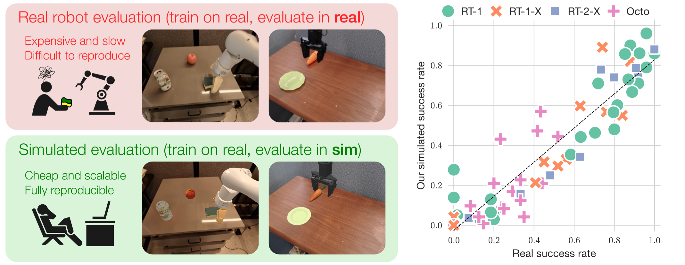

Significant progress has been made in building generalist robot manipulation policies, yet their scalable and reproducible evaluation remains challenging, as real-world evaluation is operationally expensive and inefficient. We propose employing physical simulators as efficient, scalable, and informative complements to real-world evaluations. These simulation evaluations offer valuable quantitative metrics for checkpoint selection, insights into potential real-world policy behaviors or failure modes, and standardized setups to enhance reproducibility.

This repository's code is based in the [SAPIEN](https://sapien.ucsd.edu/) simulator and the CPU based [ManiSkill2](https://maniskill2.github.io/) benchmark. We have also integrated the Bridge dataset environments into ManiSkill3, which offers GPU parallelization and can run 10-15x faster than the ManiSkill2 version. For instructions on how to use the GPU parallelized environments and evaluate policies on them, see: https://github.com/simpler-env/SimplerEnv/tree/maniskill3

This repository encompasses 2 real-to-sim evaluation setups:
- `Visual Matching` evaluation: Matching real & sim visual appearances for policy evaluation by overlaying real-world images onto simulation backgrounds and adjusting foreground object and robot textures in simulation.
- `Variant Aggregation` evaluation: creating different sim environment variants (e.g., different backgrounds, lightings, distractors, table textures, etc) and averaging their results.

We hope that our work guides and inspires future real-to-sim evaluation efforts.

- [SimplerEnv: Simulated Manipulation Policy Evaluation Environments for Real Robot Setups](#simplerenv-simulated-manipulation-policy-evaluation-environments-for-real-robot-setups)
  - [Getting Started](#getting-started)
  - [Installation](#installation)
  - [Examples](#examples)
  - [Current Environments](#current-environments)
  - [Compare Your Policy Evaluation Approach to SIMPLER](#compare-your-policy-evaluation-approach-to-simpler)
  - [Code Structure](#code-structure)
  - [Adding New Policies](#adding-new-policies)
  - [Adding New Real-to-Sim Evaluation Environments and Robots](#adding-new-real-to-sim-evaluation-environments-and-robots)
  - [Full Installation (RT-1 and Octo Inference, Env Building)](#full-installation-rt-1-and-octo-inference-env-building)
    - [RT-1 Inference Setup](#rt-1-inference-setup)
    - [Octo Inference Setup](#octo-inference-setup)
  - [Troubleshooting](#troubleshooting)
  - [Citation](#citation)


## Getting Started

Follow the [Installation](#installation) section to install the minimal requirements for our environments. Then you can run the following minimal inference script with interactive python. The scripts creates prepackaged environments for our `visual matching` evaluation setup.

```python
import simpler_env
from simpler_env.utils.env.observation_utils import get_image_from_maniskill2_obs_dict

env = simpler_env.make('google_robot_pick_coke_can')
obs, reset_info = env.reset()
instruction = env.get_language_instruction()
print("Reset info", reset_info)
print("Instruction", instruction)

done, truncated = False, False
while not (done or truncated):
   # action[:3]: delta xyz; action[3:6]: delta rotation in axis-angle representation;
   # action[6:7]: gripper (the meaning of open / close depends on robot URDF)
   image = get_image_from_maniskill2_obs_dict(env, obs)
   action = env.action_space.sample() # replace this with your policy inference
   obs, reward, done, truncated, info = env.step(action) # for long horizon tasks, you can call env.advance_to_next_subtask() to advance to the next subtask; the environment might also autoadvance if env._elapsed_steps is larger than a threshold
   new_instruction = env.get_language_instruction()
   if new_instruction != instruction:
      # for long horizon tasks, we get a new instruction when robot proceeds to the next subtask
      instruction = new_instruction
      print("New Instruction", instruction)

episode_stats = info.get('episode_stats', {})
print("Episode stats", episode_stats)
```

Additionally, you can play with our environments in an interactive manner through [`ManiSkill2_real2sim/mani_skill2_real2sim/examples/demo_manual_control_custom_envs.py`](https://github.com/simpler-env/ManiSkill2_real2sim/blob/main/mani_skill2_real2sim/examples/demo_manual_control_custom_envs.py). See the script for more details and commands.

## Installation

Prerequisites:
- CUDA version >=11.8 (this is required if you want to perform a full installation of this repo and perform RT-1 or Octo inference)
- An NVIDIA GPU (ideally RTX; for non-RTX GPUs, such as 1080Ti and A100, environments that involve ray tracing will be slow). Currently TPU is not supported as SAPIEN requires a GPU to run.

Create an anaconda environment:
```
conda create -n simpler_env python=3.10 (any version above 3.10 should be fine)
conda activate simpler_env
```

Clone this repo:
```
git clone https://github.com/simpler-env/SimplerEnv --recurse-submodules
```

Install numpy<2.0 (otherwise errors in IK might occur in pinocchio):
```
pip install numpy==1.24.4
```

Install ManiSkill2 real-to-sim environments and their dependencies:
```
cd {this_repo}/ManiSkill2_real2sim
pip install -e .
```

Install this package:
```
cd {this_repo}
pip install -e .
```

**If you'd like to perform evaluations on our provided agents (e.g., RT-1, Octo), or add new robots and environments, please additionally follow the full installation instructions [here](#full-installation-rt-1-and-octo-inference-env-building).**


## Examples

- Simple RT-1 and Octo evaluation script on prepackaged environments with visual matching evaluation setup: see [`simpler_env/simple_inference_visual_matching_prepackaged_envs.py`](https://github.com/simpler-env/SimplerEnv/blob/main/simpler_env/simple_inference_visual_matching_prepackaged_envs.py).
- Colab notebook for RT-1 and Octo inference: see [this link](https://colab.research.google.com/github/simpler-env/SimplerEnv/blob/main/example.ipynb).
- Environment interactive visualization and manual control: see [`ManiSkill2_real2sim/mani_skill2_real2sim/examples/demo_manual_control_custom_envs.py`](https://github.com/simpler-env/ManiSkill2_real2sim/blob/main/mani_skill2_real2sim/examples/demo_manual_control_custom_envs.py)
- Policy inference scripts to reproduce our Google Robot and WidowX real-to-sim evaluation results with sweeps over object / robot poses and advanced loggings. These contain both visual matching and variant aggregation evaluation setups along with RT-1, RT-1-X, and Octo policies. See [`scripts/`](https://github.com/simpler-env/SimplerEnv/tree/main/scripts).
- Real-to-sim evaluation videos from running `scripts/*.sh`: see [this link](https://huggingface.co/datasets/xuanlinli17/simpler-env-eval-example-videos/tree/main).

## Current Environments

To get a list of all available environments, run:
```
import simpler_env
print(simpler_env.ENVIRONMENTS)
```

| Task Name | ManiSkill2 Env Name | Image (Visual Matching) |
| ----------- | ----- | ----- |
| google_robot_pick_coke_can | GraspSingleOpenedCokeCanInScene-v0 | 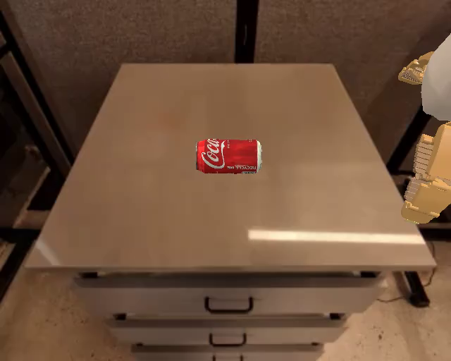 |
| google_robot_pick_object | GraspSingleRandomObjectInScene-v0 | 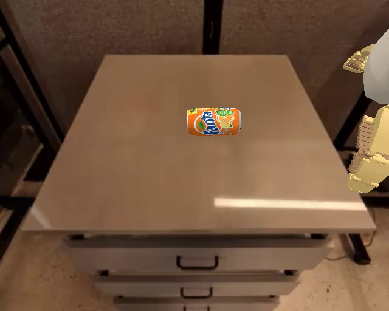 |
| google_robot_move_near | MoveNearGoogleBakedTexInScene-v1 | 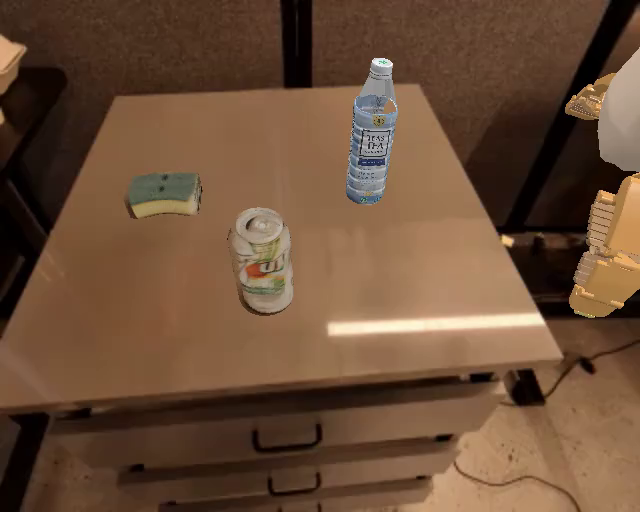 |
| google_robot_open_drawer | OpenDrawerCustomInScene-v0 | 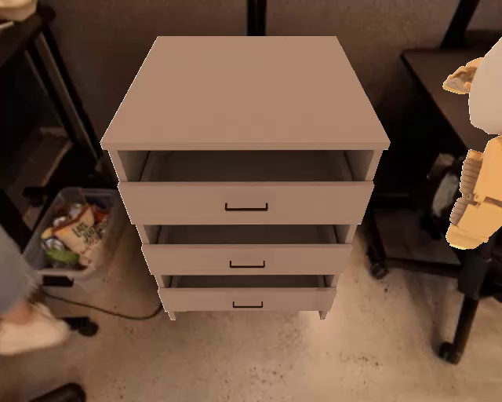 |
| google_robot_close_drawer | CloseDrawerCustomInScene-v0 | 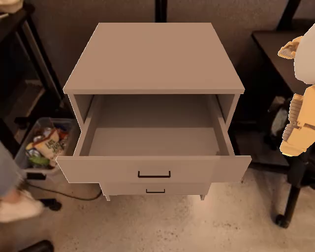 |
| google_robot_place_in_closed_drawer | PlaceIntoClosedDrawerCustomInScene-v0 | 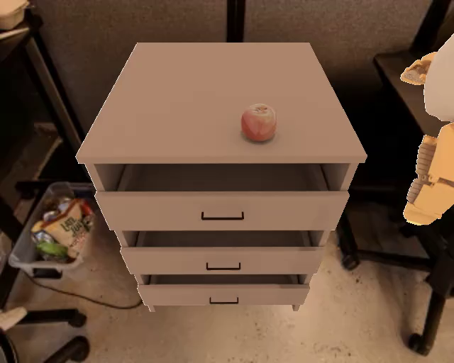 |
| widowx_spoon_on_towel    | PutSpoonOnTableClothInScene-v0                | 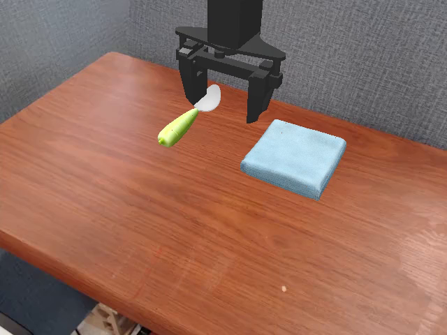 |
| widowx_carrot_on_plate   | PutCarrotOnPlateInScene-v0                    | 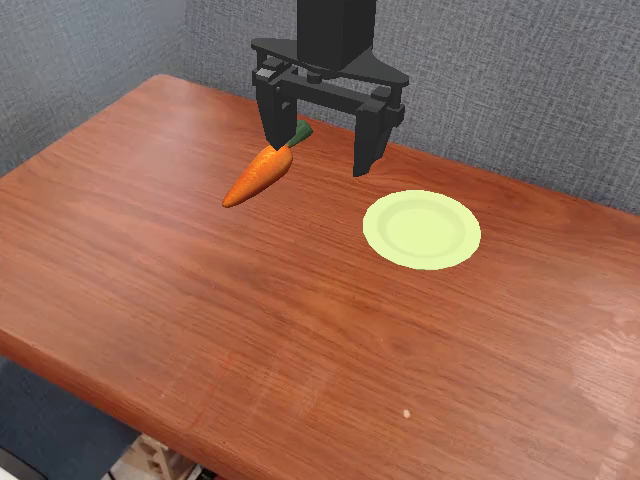 |
| widowx_stack_cube        | StackGreenCubeOnYellowCubeBakedTexInScene-v0  | 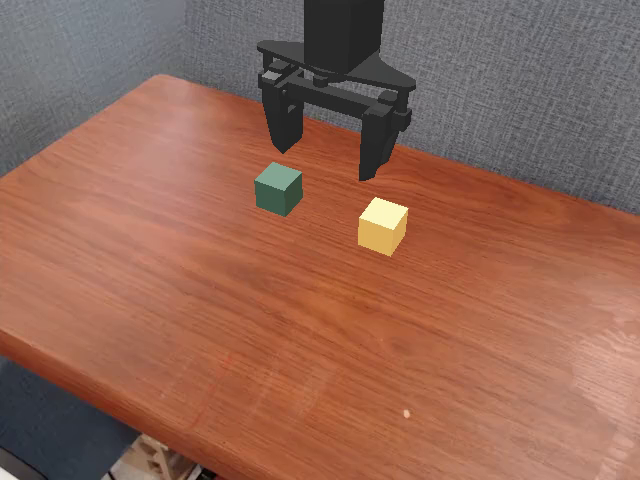 |
| widowx_put_eggplant_in_basket        | PutEggplantInBasketScene-v0  | 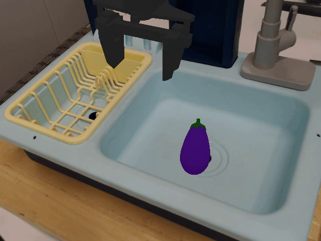 |

We also support creating sub-tasks variations such as `google_robot_pick_{horizontal/vertical/standing}_coke_can`, `google_robot_open_{top/middle/bottom}_drawer`, and `google_robot_close_{top/middle/bottom}_drawer`. For the `google_robot_place_in_closed_drawer` task, we use the `google_robot_place_apple_in_closed_top_drawer` subtask for paper evaluations.

By default, Google Robot environments use a control frequency of 3hz, and Bridge environments use a control frequency of 5hz. Simulation frequency is ~500hz.


## Compare Your Policy Evaluation Approach to SIMPLER

We make it easy to compare your offline robot policy evaluation approach to SIMPLER. In [our paper](https://simpler-env.github.io/), we use two metrics to measure the quality of simulated evaluation pipelines: Mean Maximum Rank Violation (MMRV) and the Pearson Correlation Coefficient. Both capture how well the offline evaluations reflect the policy's real-world performance and behaviors during robot rollouts.

To make comparisons easy, we provide our real and SIMPLER evaluation performance for all policies on all tasks. We also provide the corresponding functions for computing the aforementioned metrics we report in the paper.

To compute the corresponding metrics for *your* offline policy evaluation approach `your_sim_eval(task, policy)`, you can use the following snippet:
```
from simpler_env.utils.metrics import mean_maximum_rank_violation, pearson_correlation, REAL_PERF

sim_eval_perf = [
    your_sim_eval(task="google_robot_move_near", policy=p) 
    for p in ["rt-1-x", "octo", ...]
]
real_eval_perf = [
    REAL_PERF["google_robot_move_near"][p] for p in ["rt-1-x", "octo", ...]
]
mmrv = mean_maximum_rank_violation(real_eval_perf, sim_eval_perf)
pearson = pearson_correlation(real_eval_perf, sim_eval_perf)
```

To reproduce the key numbers from our paper for SIMPLER, you can run the [`tools/calc_metrics.py`](tools/calc_metrics.py) script:
```
python3 tools/calc_metrics.py
```

## Code Structure

```
ManiSkill2_real2sim/: the ManiSkill2 real-to-sim environment codebase, which contains the environments, robots, and objects for real-to-sim evaluation.
   data/
      custom/: custom object assets (e.g., coke can, cabinet) and their infos
      hab2_bench_assets/: custom scene assets
      real_inpainting/: real-world inpainting images for visual matching evaluation
      debug/: debugging assets
   mani_skill2_real2sim/
      agents/: robot agents, configs, and controller implementations
      assets/: robot assets such as URDF and meshes
      envs/: environments
      examples/demo_manual_control_custom_envs.py: interactive script for environment visualization and manual
      utils/
   ...
simpler_env/
   evaluation/: real-to-sim evaluator with advanced environment building and logging
      argparse.py: argument parser supporting custom policy and environment building
      maniskill2_evaluator.py: evaluator that supports environment parameter sweeps and advanced logging
   policies/: policy implementations
      rt1/: RT-1 policy implementation
      octo/: Octo policy implementation
   utils/:
      env/: environment building and observation utilities
      debug/: debugging tools for policies and robots
      ...
   main_inference.py: main inference script, taking in args from evaluation.argparse and calling evaluation.maniskill2_evaluator
   simple_inference_visual_matching_prepackaged_envs.py: an independent simple inference script on prepackaged environments, doesn't depend on evaluation/*
tools/
   robot_object_visualization/: tools for visualizing robots and objects when creating new environments
   sysid/: tools for system identification when adding new robots
   calc_metrics.py: tools for summarizing eval results and calculating metrics, such as Mean Maximum Rank Violation (MMRV) and Pearson Correlation
   coacd_process_mesh.py: tools for generating convex collision meshes through CoACD when adding new assets
   merge_videos.py: tools for merging videos into one
   ...
scripts/: example bash scripts for policy inference under our variant aggregation / visual matching evaluation setup,
          with custom environment building and advanced logging; also useful for reproducing our evaluation results
...
```

## Adding New Policies

If you want to use existing environments for evaluating new policies, you can keep `./ManiSkill2_real2sim` as is.

1. Implement new policy inference scripts in `simpler_env/policies/{your_new_policy}`, following the examples for RT-1 (`simpler_env/policies/rt1`) and Octo (`simpler_env/policies/octo`) policies.
2. You can now use `simpler_env/simple_inference_visual_matching_prepackaged_envs.py` to perform policy evaluations in simulation.
   - If the policy behaviors deviate a lot from those in the real-world, you can write similar scripts as in `simpler_env/utils/debug/{policy_name}_inference_real_video.py` to debug the policy behaviors. The debugging script performs policy inference by feeding real eval video frames into the policy. If the policy behavior still deviates significantly from real, this may suggest that policy actions are processed incorrectly into the simulation environments. Please double check action orderings and action spaces.
3. If you'd like to perform customized evaluations,
   - Modify a few lines in `simpler_env/main_inference.py` to support your new policies.
   - Add policy inference scripts in `scripts/` with customized configs.
   - Optionally, modify the scripts in `tools/calc_metrics.py` to calculate the real-to-sim evaluation metrics for your new policies.


## Adding New Real-to-Sim Evaluation Environments and Robots

We provide a step-by-step guide to add new real-to-sim evaluation environments and robots in [this README](ADDING_NEW_ENVS_ROBOTS.md)


## Full Installation (RT-1 and Octo Inference, Env Building)

If you'd like to perform evaluations on our provided agents (e.g., RT-1, Octo), or add new robots and environments, please follow the full installation instructions below.

```
sudo apt install ffmpeg
```

```
pip install tensorflow==2.15.0
pip install -r requirements_full_install.txt
pip install tensorflow[and-cuda]==2.15.1 # tensorflow gpu support
```

Install simulated annealing utils for system identification:
```
pip install git+https://github.com/nathanrooy/simulated-annealing
```

### RT-1 Inference Setup

Download RT-1 Checkpoint:
```
# First, install gsutil following https://cloud.google.com/storage/docs/gsutil_install

# Make a checkpoint dir:
mkdir {this_repo}/checkpoints

# RT-1-X
cd {this_repo}
gsutil -m cp -r gs://gdm-robotics-open-x-embodiment/open_x_embodiment_and_rt_x_oss/rt_1_x_tf_trained_for_002272480_step.zip .
unzip rt_1_x_tf_trained_for_002272480_step.zip
mv rt_1_x_tf_trained_for_002272480_step checkpoints
rm rt_1_x_tf_trained_for_002272480_step.zip

# RT-1-Converged
cd {this_repo}
gsutil -m cp -r gs://gdm-robotics-open-x-embodiment/open_x_embodiment_and_rt_x_oss/rt_1_tf_trained_for_000400120 .
mv rt_1_tf_trained_for_000400120 checkpoints

# RT-1-15%
cd {this_repo}
gsutil -m cp -r gs://gdm-robotics-open-x-embodiment/open_x_embodiment_and_rt_x_oss/rt_1_tf_trained_for_000058240 .
mv rt_1_tf_trained_for_000058240 checkpoints

# RT-1-Begin
cd {this_repo}
gsutil -m cp -r gs://gdm-robotics-open-x-embodiment/open_x_embodiment_and_rt_x_oss/rt_1_tf_trained_for_000001120 .
mv rt_1_tf_trained_for_000001120 checkpoints      
```

### Octo Inference Setup

Install Octo:
```
pip install --upgrade "jax[cuda11_pip]==0.4.20" -f https://storage.googleapis.com/jax-releases/jax_cuda_releases.html # or jax[cuda12_pip] if you have CUDA 12

cd {this_repo}
git clone https://github.com/octo-models/octo/
cd octo
git checkout 653c54acde686fde619855f2eac0dd6edad7116b  # we use octo-1.0
pip install -e .
# You don't need to run "pip install -r requirements.txt" inside the octo repo; the package dependencies are already handled in the simpler_env repo
# Octo checkpoints are managed by huggingface, so you don't need to download them manually.
```

If you are using CUDA 12, then to use GPU for Octo inference, you need CUDA version >= 12.2 to satisfy the requirement of Jax; in this case, you can perform a runfile install of the corresponding CUDA (e.g., version 12.3), then set the environment variables whenever you run Octo inference scripts:

`PATH=/usr/local/cuda-12.3/bin:$PATH   LD_LIBRARY_PATH=/usr/local/cuda-12.3/lib64:$LD_LIBRARY_PATH   bash scripts/octo_xxx_script.sh`

## Troubleshooting

1. If you encounter issues such as

```
RuntimeError: vk::Instance::enumeratePhysicalDevices: ErrorInitializationFailed
Some required Vulkan extension is not present. You may not use the renderer to render, however, CPU resources will be still available.
Segmentation fault (core dumped)
```

Follow [this link](https://maniskill.readthedocs.io/en/latest/user_guide/getting_started/installation.html#vulkan) to troubleshoot the issue. (Even though the doc points to SAPIEN 3 and ManiSkill3, the troubleshooting section still applies to the current environments that use SAPIEN 2.2 and ManiSkill2).

2. You can ignore the following error if it is caused by tensorflow's internal code. Sometimes this error will occur when running the inference or debugging scripts.

```
TypeError: 'NoneType' object is not subscriptable
```


## Citation

If you find our ideas / environments helpful, please cite our work at
```
@article{li24simpler,
         title={Evaluating Real-World Robot Manipulation Policies in Simulation},
         author={Xuanlin Li and Kyle Hsu and Jiayuan Gu and Karl Pertsch and Oier Mees and Homer Rich Walke and Chuyuan Fu and Ishikaa Lunawat and Isabel Sieh and Sean Kirmani and Sergey Levine and Jiajun Wu and Chelsea Finn and Hao Su and Quan Vuong and Ted Xiao},
         journal = {arXiv preprint arXiv:2405.05941},
         year={2024}
}
```
